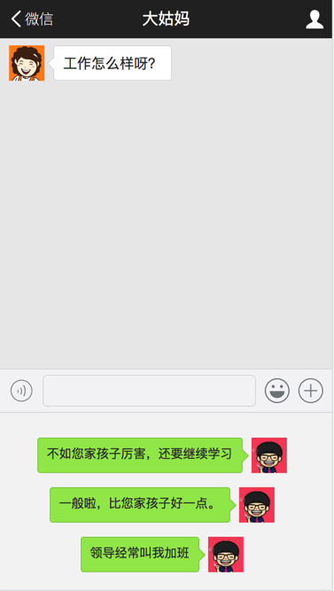

# 微信聊天窗口界面

使用 HTML + CSS 模拟微信聊天列表

## 参考资料：
- [深入浅出 css 布局](http://layout.imweb.io/article/flexbox.html)

## 工具:
- icon来源: [iconfont.cn](http://www.iconfont.cn/)
- 测量工具: [markman](http://www.getmarkman.com/)
